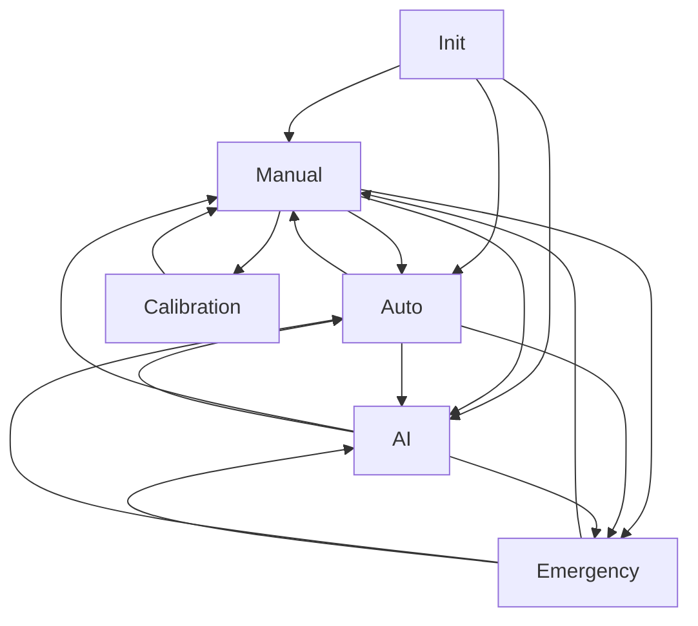

# myCobot 280 ROS2 API仕様書

## 📡 ROS2インターフェース詳細仕様

### 🔖 Topics

#### `/cobot/status` (std_msgs/String)
**ロボットの包括的状態情報（JSON形式）**

**発行頻度**: 10Hz  
**説明**: ロボットの現在状態をリアルタイムで配信

**メッセージ例**:
```json
{
  "connected": true,
  "mode": "manual",
  "is_moving": false,
  "angles": [-48.77, 135.0, -135.0, -12.39, 61.87, -62.75],
  "coords": [150.2, 45.8, 120.5, 0.0, 0.0, 0.0],
  "gripper_value": 38,
  "last_update": "2025-08-02T17:00:00",
  "emergency": false
}
```

**フィールド詳細**:
- `connected` (bool): ロボット接続状態
- `mode` (string): 現在のモード ("manual"/"auto"/"ai"/"calibration"/"emergency"/"init")
- `is_moving` (bool): 動作中かどうか
- `angles` (array): 関節角度 [J1, J2, J3, J4, J5, J6] (度)
- `coords` (array): 座標 [X, Y, Z, RX, RY, RZ] (mm, 度)
- `gripper_value` (float): グリッパー開度 (0-100)
- `last_update` (string): 最終更新時刻
- `emergency` (bool): 緊急停止状態

---

#### `/cobot/save_position` (std_msgs/String)
**位置保存トピック**

**説明**: 文字列で位置名を送信すると現在位置を保存

**使用例**:
```bash
ros2 topic pub /cobot/save_position std_msgs/String "data: 'my_position'"
```

---

### 🔧 Services

#### `/cobot/manual` (std_srvs/Empty)
**マニュアルモード切り替え**

**説明**: ロボットを手動操作モードに切り替え  
**LED**: 🟡 黄色  
**機能**: フリーモード有効、手動ティーチング可能

**使用例**:
```bash
ros2 service call /cobot/manual std_srvs/srv/Empty
```

---

#### `/cobot/auto` (std_srvs/Empty)
**自動モード切り替え**

**説明**: 自動実行モードに切り替え  
**LED**: 🔵 青色  
**機能**: プログラム実行、外部コマンド受付

**使用例**:
```bash
ros2 service call /cobot/auto std_srvs/srv/Empty
```

---

#### `/cobot/ai` (std_srvs/Empty)
**AIモード切り替え**

**説明**: AI統合制御モードに切り替え  
**LED**: 🟣 紫色  
**機能**: VLA（Vision-Language-Action）モデル連携

**使用例**:
```bash
ros2 service call /cobot/ai std_srvs/srv/Empty
```

---

#### `/cobot/home` (std_srvs/Empty)
**ホーム移動**

**説明**: 安全な基準位置へ移動（全モードで実行可能）  
**安全性**: 関節制限内の安全位置に移動  
**速度**: 80 (適度な速度で安全移動)

**使用例**:
```bash
ros2 service call /cobot/home std_srvs/srv/Empty
```

---

#### `/cobot/save` (cobot_interfaces/srv/SavePosition)
**位置保存サービス**

**リクエスト**:
```
string position_name    # 保存する位置の名前
```

**レスポンス**:
```
bool success           # 保存成功/失敗
string message         # 結果メッセージ
```

**説明**: 現在の関節角度とグリッパー状態を指定名で保存

**使用例**:
```bash
ros2 service call /cobot/save cobot_interfaces/srv/SavePosition "{position_name: 'work_position'}"
```

---

#### `/cobot/goto_home` (std_srvs/Empty)
**ホーム位置移動**

**説明**: 保存されたhome位置に移動  
**グリッパー**: 保存時のグリッパー状態も復元

---

#### `/cobot/goto_safe` (std_srvs/Empty)
**安全位置移動**

**説明**: 保存されたsafe位置に移動  
**用途**: 作業前の安全な待機位置

---

#### `/cobot/goto_last` (std_srvs/Empty)
**最後の位置移動**

**説明**: 最後に保存された位置に移動  
**便利機能**: 名前を覚えていなくても直前の位置に戻れる

---

#### `/cobot/list` (cobot_interfaces/srv/ListPositions)
**保存位置一覧取得**

**リクエスト**: (空)

**レスポンス**:
```
string[] position_names    # 保存されている位置名のリスト
string details            # 詳細情報（JSON形式）
```

**詳細情報例**:
```json
{
  "total_positions": 5,
  "positions": [
    {
      "name": "home",
      "angles": [-48.77, 135, -135, -12.39, 61.87, -62.75],
      "gripper_value": 38,
      "created_at": "2025-08-02T16:59:53"
    }
  ]
}
```

---

#### `/cobot/delete` (cobot_interfaces/srv/DeletePosition)
**位置削除**

**リクエスト**:
```
string position_name    # 削除する位置名
```

**レスポンス**:
```
bool success           # 削除成功/失敗
string message         # 結果メッセージ
```

**保護**: 基本位置（home, safe, ready）は削除不可

---

### 🛡️ 安全機能API

#### 関節制限チェック
**全ての動作で自動実行**

**制限値**:
```
J1: -180° ~ +180°
J2: -135° ~ +135°  
J3: -135° ~ +135°
J4: -150° ~ +150°
J5: -145° ~ +145°
J6: -165° ~ +165°
```

#### 安全モード設定
**コード内設定** (`save_safety_mode`):
- `"strict"`: 制限超過時は保存をブロック
- `"loose"`: 制限超過時は自動修正して保存（デフォルト）
- `"off"`: 安全チェック無効

---

### 🎮 コマンドフィルタリング

**モード別コマンド制限**:

| コマンド | Manual | Auto | AI | Calibration | Emergency |
|----------|--------|------|----|-----------  |-----------|
| 手動移動 | ✅ | ❌ | ❌ | ✅ | ❌ |
| 自動移動 | ❌ | ✅ | ✅ | ❌ | ❌ |
| ホーム移動 | ✅ | ✅ | ✅ | ✅ | ❌ |
| 位置保存 | ✅ | ✅ | ✅ | ✅ | ❌ |
| モード切替 | ✅ | ✅ | ✅ | ✅ | ✅ |
| 緊急停止 | ✅ | ✅ | ✅ | ✅ | ✅ |

---

### 🔄 状態遷移



---

### 📝 位置データ形式

**ファイル保存場所**: `~/cobot/positions/[position_name].json`

**JSON構造**:
```json
{
  "name": "position_name",
  "angles": [float, float, float, float, float, float],
  "description": "string",
  "gripper_value": float,
  "created_at": "timestamp"
}
```

**制約**:
- `name`: 英数字、アンダースコア、ハイフン可
- `angles`: 6要素の配列（J1-J6の角度）
- `gripper_value`: 0-100の範囲
- 特殊文字や日本語は避ける（ファイル名制限）

---

### 🚨 エラーハンドリング

**共通エラーレスポンス**:
```json
{
  "success": false,
  "error_code": "ERROR_CODE",
  "message": "Human readable error message"
}
```

**主要エラーコード**:
- `ROBOT_NOT_CONNECTED`: ロボット未接続
- `INVALID_ANGLE`: 関節制限超過
- `POSITION_NOT_FOUND`: 指定位置が存在しない
- `MODE_RESTRICTED`: 現在モードで実行不可
- `SAVE_FAILED`: 位置保存失敗
- `MOVEMENT_FAILED`: 移動実行失敗

---

### 🔧 開発者向け情報

**カスタムメッセージ追加手順**:
1. `msg/` または `srv/` にファイル追加
2. `CMakeLists.txt` を更新
3. `package.xml` に依存関係追加
4. `colcon build`

**新サービス追加例**:
```python
# cobot_node.py内
self.custom_service = self.create_service(
    CustomSrv, 
    '/cobot/custom', 
    self.custom_callback
)
```

---

### 📊 パフォーマンス仕様

- **状態更新頻度**: 10Hz
- **最大移動速度**: 100 (緊急時以外は80推奨)
- **位置精度**: ±1度（関節角度）
- **応答時間**: <100ms（サービスコール）
- **同時接続**: 制限なし（ROS2標準）

---

### 🎯 AI統合仕様

**VLAモデル連携**:
- **入力**: `/cobot/status` から現在状態取得
- **出力**: サービスコール或いは直接角度指令
- **安全層**: 全AI出力は安全チェック通過
- **学習データ**: 位置ファイルをtraining dataとして活用可能

**推奨ワークフロー**:
1. AI → `/cobot/ai` でモード切替
2. AI → `/cobot/status` で現在状態確認
3. AI → 目標位置計算
4. AI → 安全チェック
5. AI → 移動コマンド実行